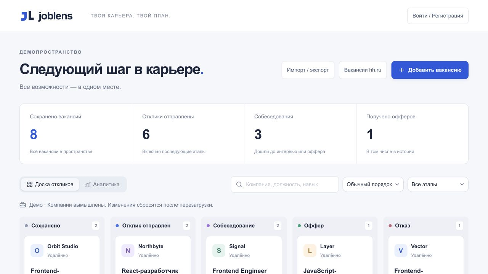
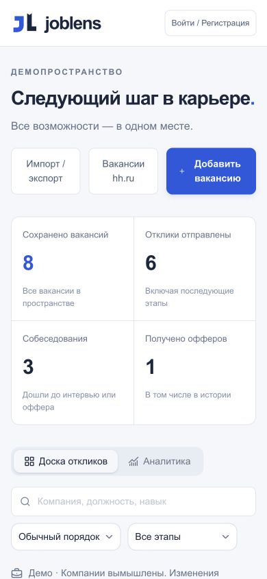

<div align="center">

# JobLens

### Поиск работы, в котором виден следующий шаг.

Вакансии, отклики, собеседования и навыки — в одном рабочем пространстве.

**React · TypeScript · Cloudflare Workers · SQLite · Python ML**

[Открыть демо](https://joblens-career-workspace.pro100macho95.chatgpt.site/demo) · [Разбор проекта](docs/PORTFOLIO.md) · [ML-эксперимент](ml/README.md) · [Запуск](#локальный-запуск)

</div>



## От вакансии до оффера

JobLens помогает вести поиск работы без разрозненных таблиц: сохранять вакансии, отмечать этапы, планировать следующие действия и понимать, какие навыки встречаются в требованиях.

Это fullstack-проект для портфолио: адаптивный интерфейс, собственный REST API, постоянное хранение, email-аутентификация и небольшой воспроизводимый ML-эксперимент.

| Возможность | Как это работает |
| --- | --- |
| Доска откликов | Пять этапов, перетаскивание карточек, поиск и фильтры |
| История и планы | Изменения этапов, заметки, встречи и следующие действия |
| Аналитика | Воронка, динамика откликов, конверсии и вакансии без движения |
| Навыки | Извлечение технологий из текста и сравнение с личным списком |
| ML-анализ | Предполагаемый контекст навыка: обязательный, желательный или не требующийся |
| Перенос данных | CSV с предпросмотром и проверкой дубликатов, JSON-копии с историей |
| Личный аккаунт | Одноразовый код по почте, серверные сессии, экспорт и удаление данных |

## Попробовать за две минуты

1. Откройте [демопространство](https://joblens-career-workspace.pro100macho95.chatgpt.site/demo) без регистрации.
2. Откройте карточку, измените этап и добавьте следующее действие.
3. Перейдите в аналитику и посмотрите, как изменились показатели.
4. Сравните требования вакансии со своими навыками.

Демо использует вымышленные компании и сбрасывается при перезагрузке. Личный вход сейчас доступен только владельцу. Размещённая версия может отставать от кода репозитория; актуальный ML-интерфейс можно проверить локально.

<details>
<summary><strong>Мобильный интерфейс</strong></summary>
<br>


</details>

## Что интересно в реализации

- **Конкурентные изменения.** Ревизия карточки защищает от перезаписи изменений из другой вкладки: устаревшее сохранение получает `409`.
- **Изоляция данных.** Сервер определяет владельца по сессии, запросы ограничены его идентификатором. Клиент не выбирает владельца.
- **Одноразовые коды.** Ограниченный срок действия и число попыток; успешно использованный код удаляется из базы.
- **Восстановление без дубликатов.** Исходный идентификатор сохраняется между поколениями резервных копий. Квоты и пакетные операции защищают от частичного восстановления.
- **Эксплуатация.** GitHub Actions проверяет БД, запускает очистку и сохраняет зашифрованные резервные копии. Приватный ключ не нужен серверу приложения.
- **Проверяемый ML.** Python обучает модель, браузер исполняет её параметры. Есть отдельный набор проверки, отчёт об ошибках и проверка совпадения прогнозов.

## Архитектура

```text
React + TypeScript
        │ same-origin REST API
        ▼
Vinext / Cloudflare Workers
        ├── D1 / SQLite — аккаунты, сессии, вакансии
        ├── Resend — письма с кодами входа
        └── API hh.ru — поиск вакансий, когда API доступен

Python → параметры Naive Bayes → анализ в браузере
GitHub Actions → проверка БД / очистка / зашифрованные копии
```

| Слой | Технологии |
| --- | --- |
| Интерфейс | React 19, TypeScript, Base UI / shadcn, Recharts |
| Сервер | Vinext, Cloudflare Workers, REST |
| Данные | D1 (SQLite), Drizzle для схемы и миграций |
| ML | Python, Naive Bayes, JSON-параметры модели |
| Проверки | Node test runner, Python, TypeScript, oxlint, GitHub Actions |

## ML без завышенных обещаний

Модель классифицирует **контекст упоминания навыка**, а не вероятность получить работу. Обучение: 60 синтетических примеров; проверка: 24 отдельных примера. Macro F1 — **0,584**, у постоянного baseline — **0,167**.

Это учебный эксперимент, не оценка качества на реальных вакансиях. Интерфейс показывает исходную цитату, требует проверки пользователем и не меняет навыки автоматически. Текст анализируется в браузере и не отправляется внешней модели.

[Данные, методика и воспроизведение](ml/README.md) · [Отчёт и ошибки](ml/artifacts/REPORT.md)

## Локальный запуск

Нужны Node.js ≥ 22.13 и pnpm 11.19.0.

```sh
git clone https://github.com/Miramisha/joblens.git
cd joblens
pnpm install --frozen-lockfile
pnpm db:init:local
pnpm dev
```

Откройте `/demo` по адресу, который выведет сервер. Инициализация БД предназначена для новой локальной базы; не запускайте её повторно поверх существующей схемы. Для личного входа настройте окружение по [.env.example](.env.example) и [инструкции почты](docs/EMAIL_AUTH_SETUP.md). Секреты не добавляйте в Git.

```sh
pnpm typecheck
pnpm test
pnpm lint
pnpm build
python3 tests/run-integration.py
python3 -m unittest discover -s ml -p 'test_*.py' -v
```

Интеграционный набор запускает отдельный Worker на порту 3001 с временной БД и тестовыми аккаунтами. Он проверяет вход, изоляцию, CRUD, конфликты версий, удаление аккаунта, импорт, восстановление и шифрование копий.

## Границы текущей версии

- Общая регистрация закрыта; доставка писем для всех пользователей требует отдельной настройки.
- Подключение профиля соискателя hh.ru отключено. Поиск через API зависит от доступности провайдера; предусмотрены ручной ввод и CSV.
- План действий отображается внутри приложения; почтовых напоминаний нет.
- ML проверен на небольшой синтетической выборке. Полного независимого аудита безопасности и доступности не было.
- Сервер написан на TypeScript; отдельного Go-сервиса в проекте нет.

## Документация

- [Проект как кейс для собеседования](docs/PORTFOLIO.md)
- [Подробное техническое руководство](docs/TECHNICAL_GUIDE.md)
- [Эксплуатация и резервные копии](docs/OPERATIONS.md)
- [Email-аутентификация](docs/EMAIL_AUTH_SETUP.md)
- [Возможности и ограничения hh.ru](docs/HH_SETUP.md)
- [Проверки мобильного интерфейса и ML](docs/MOBILE_ML_QA.md)
